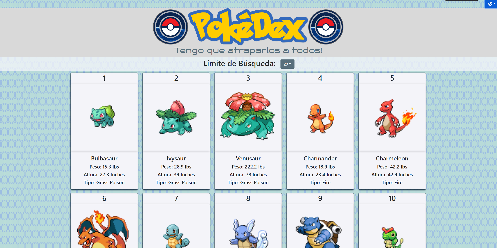
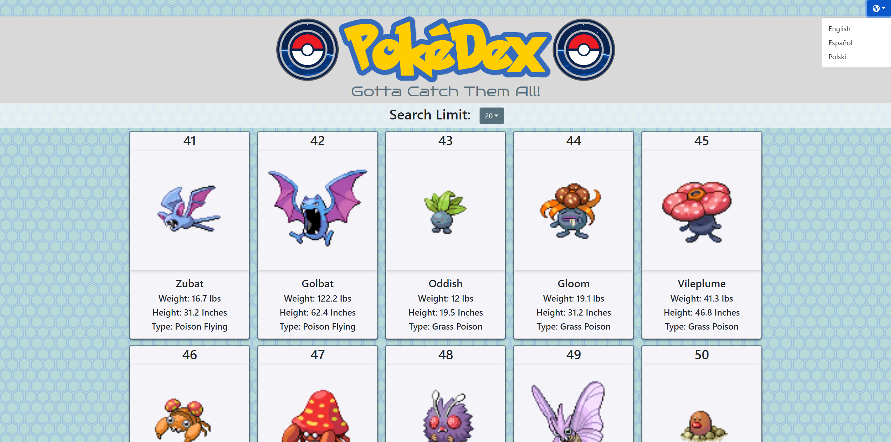

# - PokeDex -

I have recreated the Pokedex that display's all pokemon from generations 1-9. This is being used with the restful PokeApi served with the database to detailing everything about the Pokémon main game series.

## Demo

https://newpokedexp-484.netlify.app/

## Screenshots

## Badges

## API Reference

https://pokeapi.co/
